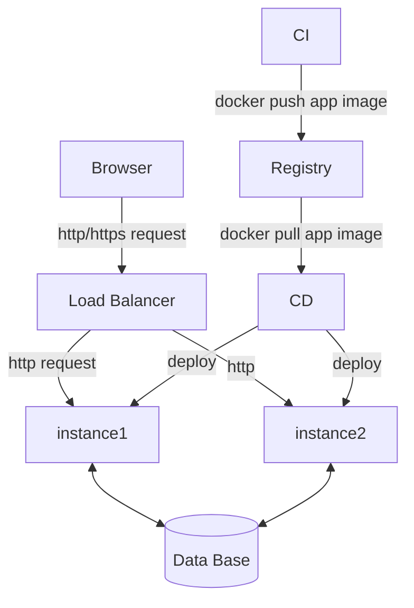
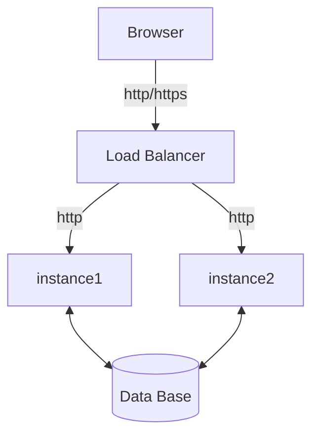
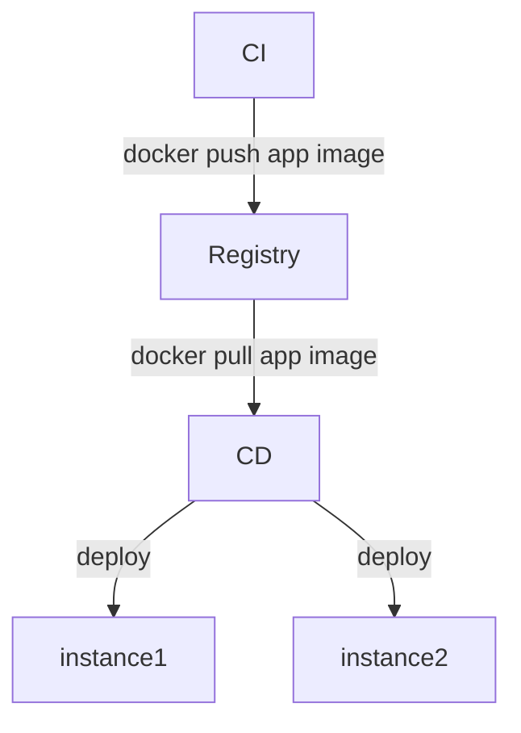

## Design provisioning and deployment of a docker-based web app in a cloud.

Let's assume that there's only one container. It's fine to use the nginx image from the docker hub for that purpose, but you can pick what you like. And let's imagine that it uses a mysql database to store data.

So the app itself and its deployment looks something like the following:

Or the app and CI/CD separately.

__Please create the infrastructure as code, omitting the actual CI and CD.__ 
You can pick the tools/languages and underlying cloud that you are most comfortable with.
This is a practical task, so some IaC descriptions or configs/scripts/k8s yaml/helm yaml are required.
You can treat containers as jobs to be scheduled in a cluster.

You are not expected to be thorough, but pick parts that make most sense to go into a code repository in your opinion. Making assumptions and cutting corners is fine. Please document the decision-making related to that.

## What we are looking for

- **Practical Skills:** Can you write functional IaC for a common pattern?
- **Planning & Prioritization:** Can you define a reasonable scope and articulate a plan?
- **Communication & Justification:** Can you clearly explain your decisions and trade-offs?
- **Thoughtful Use of Tools:** If AI is used, is it a productivity aid for a solution you understand and own?

## What is not expected

- **Thoroughness.** We are not looking for a complete solution. This is a practical task and a conversation starter. Creative cutting of corners is expected, feel free to make assumptions that suit you. Would be great if you document those for discussion.
- **Spending a lot of time.** We are not standing over you with a stopwatch, so up to you how much to spend on this. But we do understand that people are busy.
- **Not using AI.** Sorry for the double negative here. It's fine to use AI. Remember that we would like to learn about your skills here. Since using AI is also a skill, submitting AI-generated code, mentioning approaches and prompts that worked or didn't is also valuable.

## How to submit

You can submit your code/comments as a pull request to this repository or a zip archive by mail.

## Supplement

If you have some code that you can share, preferably with git history, please submit this works as well.
