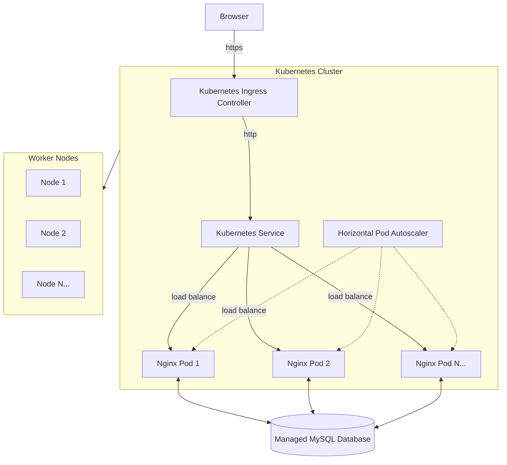
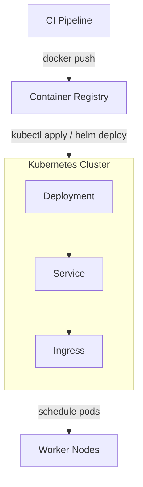
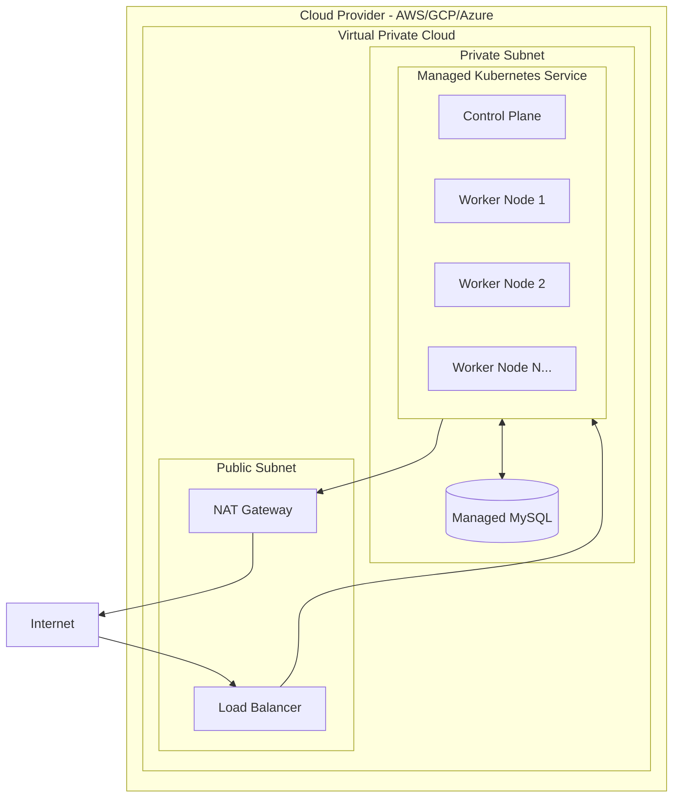

## Design provisioning and deployment of a clusterized Kubernetes web app in the cloud.

Let's assume that there's a containerized application based on the nginx image from Docker Hub, deployed in a Kubernetes cluster. The application uses a MySQL database to store data.

The clusterized architecture looks like the following:

Application and CI/CD flow:

Infrastructure overview:

__Please create the infrastructure as code and Kubernetes manifests leaving out the actual CI and CD.__ You can pick the tools/languages and underlying cloud that you are most comfortable with. This is a practical task, so some IaC, Kubernetes YAML configs, and deployment scripts are required.

Key components to implement:
- **Infrastructure as Code**: Terraform/CloudFormation/Pulumi for cloud resources (VPC, Kubernetes cluster, managed database)
- **Kubernetes Manifests**: Deployment, Service, Ingress, ConfigMaps, Secrets
- **Container Orchestration**: Pod scheduling, auto-scaling, health checks
- **Networking**: Service mesh considerations, ingress controllers, network policies
- **Storage**: Persistent volumes if needed, database connectivity
- **Security**: RBAC, pod security policies, network segmentation

You are not expected to be thorough, but pick parts that make most sense to go into a code repository in your opinion. Making assumptions and cutting corners is fine. Please document the decision making related to that, especially around:
- Choice of managed Kubernetes service (EKS/GKE/AKS)
- Database deployment strategy (managed vs in-cluster)
- Networking and security approach
- Scaling and resource management
- Development vs production considerations

You can submit your code/comments as a pull request to this repository.
