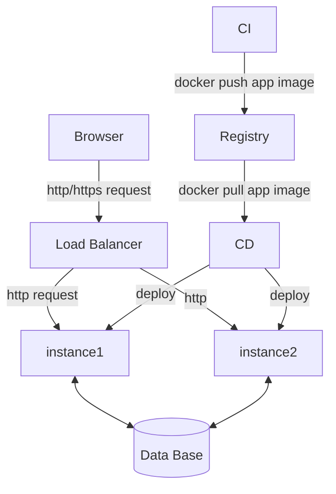
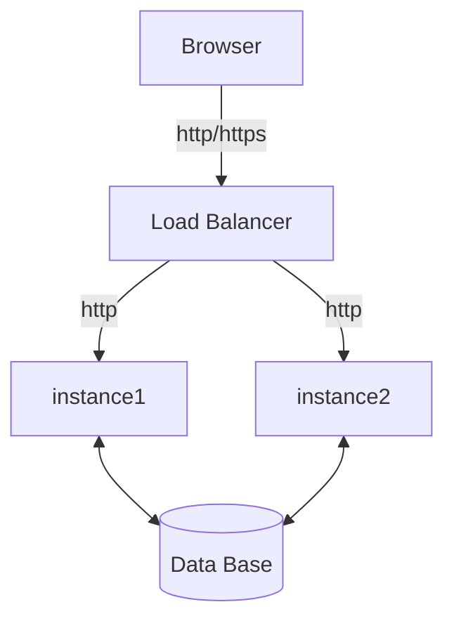
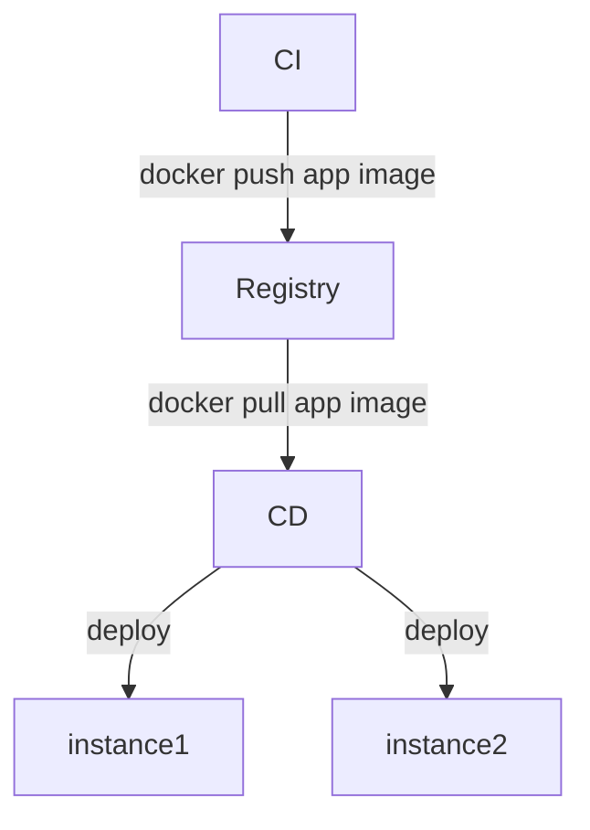

## Design provisioning and deployment of a docker based web app in a cloud.

Let's assume that there's only one container started from the docker hub nginx image. And lets imagine that it uses a mysql database to store data.

So the app itself and it's deployment looks something like the following:

Or the app and CI/CD separately.

__Please create the infrastructure as code leaving out the actual CI and CD.__ You can pick the tools/languages and underlying cloud that you are most comfortable with. This is a practical task, so some IaC or configs/scripts are required.

You are not expected to be thorough, but pick parts that make most sense to go into a code repository in your opinion. Making assumptions and cutting corners is fine. Please document the decision making related to that.

You can submit your code/comments as a pull request to this repository.
